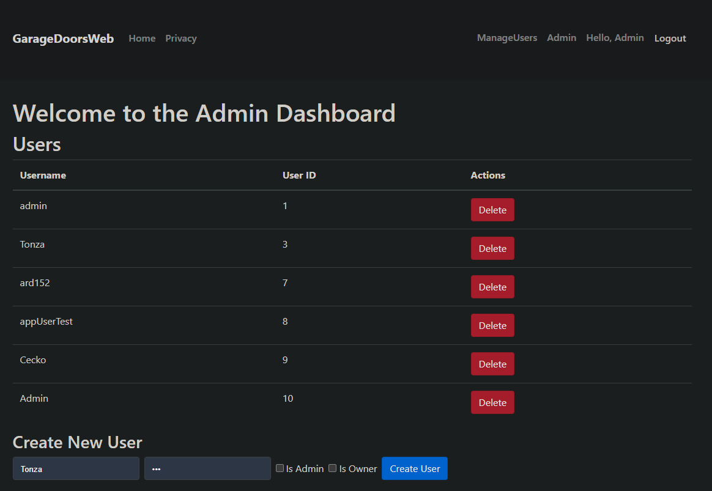
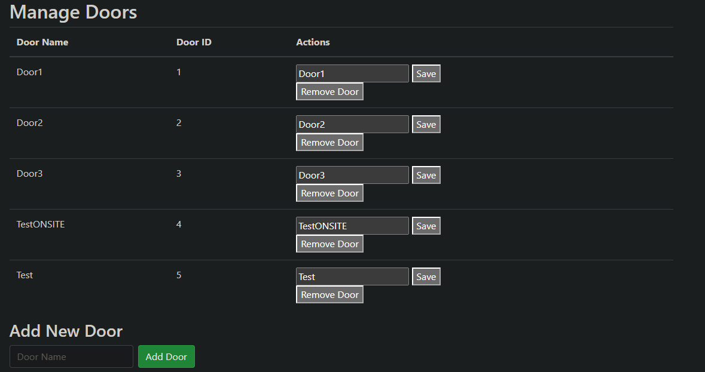
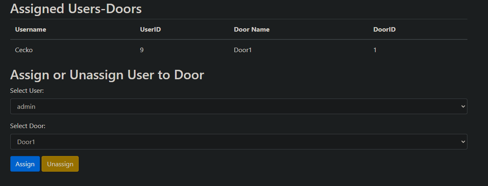
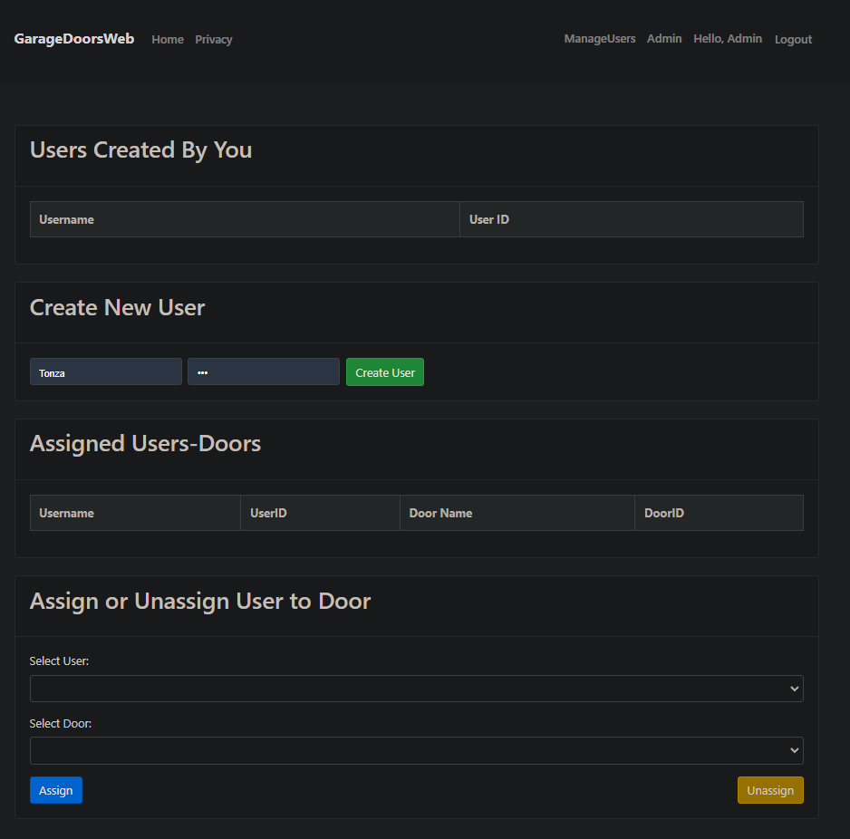
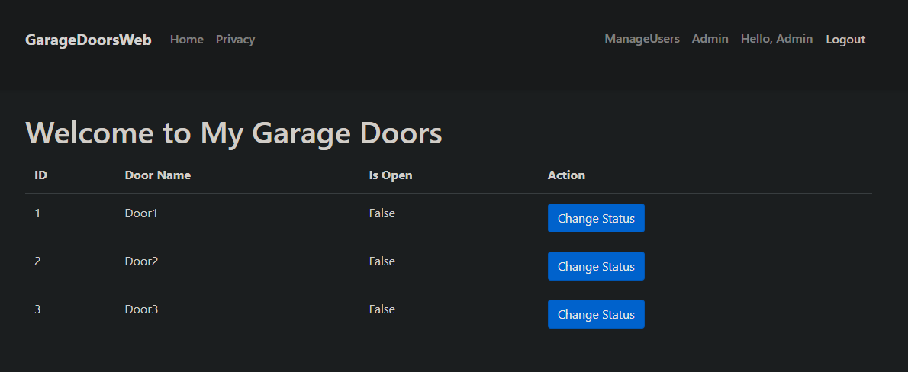

# GarageDoorsWeb

GarageDoorsWeb is a versatile web application designed to remotely manage and control garage doors. The system utilizes an Arduino for relay control, acting as button remotes for the garage doors. The web application is hosted on a Raspberry Pi 4, with a domain purchased from Namecheap. Future plans include the development of a mobile app for enhanced accessibility.

## Table of Contents
- [Features](#features)
- [Architecture](#architecture)
  - [Components](#components)
- [Getting Started](#getting-started)
  - [Prerequisites](#prerequisites)
  - [Installation](#installation)
    - [Running on Windows](#running-on-windows)
    - [Hosting on Raspberry Pi](#hosting-on-raspberry-pi)
  - [Creating the Database](#creating-the-database)
- [Usage](#usage)
  - [Account Types](#account-types)
  - [Steps to Use](#steps-to-use)
- [Future Plans](#future-plans)
- [Acknowledgments](#acknowledgments)

## Features

- **Remote Control:** Manage your garage doors remotely through a web interface.
- **Secure Login:** Utilizes JWT (JSON Web Token) for secure authentication.
- **Real-time Updates:** Receive real-time status updates of your garage doors.
- **Self-Hosted:** Hosted on a Raspberry Pi 4 for local control.
- **Mobile App:** Future development planned for a dedicated mobile app.

## Architecture

### Components

#### Web Application
- **Framework:** Built using ASP.NET Core
- **Authentication:** Secure login with JWT tokens
- **Hosting:** Hosted on a Raspberry Pi 4 or Windows

#### Arduino Controller
- **WiFi Connectivity:** Uses ESP8266 for connecting to WiFi
- **Relay Control:** Manages relays that act as button remotes for garage doors
- **Communication:** Interacts with the web application for status updates and control commands

#### Domain
- **Provider:** Domain purchased from Namecheap

#### Raspberry Pi 4
- **Hosting:** Hosts the ASP.NET Core web application

## Getting Started

### Prerequisites
- **Hardware:** Arduino with ESP8266, Raspberry Pi 4 (optional for Pi hosting)
- **Software:** ASP.NET Core SDK, Arduino IDE, MySQL or PostgreSQL for database
- **Domain:** Registered domain (optional)

### Installation

#### Running on Windows

1. **Clone the Repository:**
    ```sh
    git clone https://github.com/Metrixen/GarageDoorsWeb.git
    cd GarageDoorsWeb
    ```

2. **Setup Arduino:**
    - Load the provided Arduino sketch onto your Arduino board.
    - Ensure the ESP8266 is configured for WiFi connectivity.

3. **Configure Database:**
    - Set up a MySQL or PostgreSQL database.
    - Update the connection string in `appsettings.json`.

4. **Publish and Run the Application:**
    ```sh
    dotnet publish -c Release -o out
    cd out
    dotnet GarageDoorsWeb.dll
    ```

5. **Access the Application:**
    - Open your web browser and navigate to `http://localhost:5000`.

#### Hosting on Raspberry Pi

1. **Clone the Repository:**
    ```sh
    git clone https://github.com/Metrixen/GarageDoorsWeb.git
    cd GarageDoorsWeb
    ```

2. **Setup Arduino:**
    - Load the provided Arduino sketch onto your Arduino board.
    - Ensure the ESP8266 is configured for WiFi connectivity.

3. **Configure Raspberry Pi:**
    - Install .NET Core runtime on your Raspberry Pi:
      ```sh
      sudo apt-get update
      sudo apt-get install -y dotnet-runtime-3.1
      ```

4. **Configure Database:**
    - Set up a MySQL or PostgreSQL database.
    - Update the connection string in `appsettings.json`.

5. **Publish the Application:**
    ```sh
    dotnet publish -c Release -o out
    ```

6. **Transfer Files to Raspberry Pi:**
    - Copy the contents of the `out` directory to your Raspberry Pi.

7. **Run the Application on Raspberry Pi:**
    ```sh
    cd /path/to/your/directory
    dotnet GarageDoorsWeb.dll
    ```

8. **Access the Application:**
    - Open your web browser and navigate to the IP address of your Raspberry Pi.

### Creating the Database

1. **Setup Database:**
   - Install MySQL or PostgreSQL on your preferred host.
   - Create a new database for the application.

2. **Apply Migrations:**
   - Update the connection string in `appsettings.json`.
   - Apply the migrations to create the necessary tables:
     ```sh
     dotnet ef database update
     ```

## Usage

### Account Types

There are three types of accounts:

- **Admin**
  - Access to the admin panel where they can:
    - View all users
    - Create and remove users
    - View all doors
    - Create and remove doors
    - Rename doors
    - Assign doors to users

- **Owner**
  - Can view and control the doors assigned to them.
  - Can create and remove users.
  - Can assign/unassign users to his doors.

- **User**
  - Can view and control the doors assigned to them.

### Steps to Use

1. **Login:**
   - Use your credentials to log in securely.
   - Depending on your account type (Admin, Owner, User), you will have different access levels.

2. **Admin Panel (Admin Only):**
   - Navigate to the admin panel.
   - Manage users: see list of all users,create new users, delete existing users.

    

   - Manage doors: create new doors, delete or rename existing doors.

    

   - Assign doors to users.

    
   
3. **Owner Panel:**
   - Users created by you.
   - Create users.
   - List of the people that are assigned to your doors.
   - Assign/Unassign doors to specific users.

   

4. **Control Doors:**
   - Open or close your garage doors remotely from the web interface.
   - View real-time status updates of your garage doors.

   


## Future Plans

- **Mobile App Development:** We are planning to develop a mobile app to provide a more user-friendly and accessible way to control your garage doors.
- **Additional Features:** Exploring options for integrating more features such as voice control, enhanced security measures, and more.

## Acknowledgments

- **ASP.NET Core:** For the robust web framework.
- **ESP8266:** For the reliable WiFi connectivity.
- **Namecheap:** For domain registration services.
